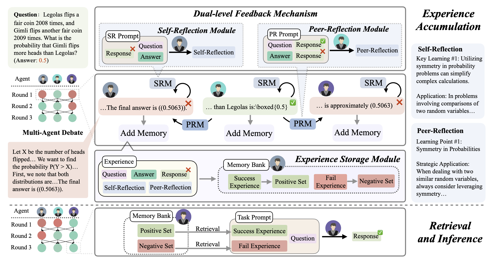
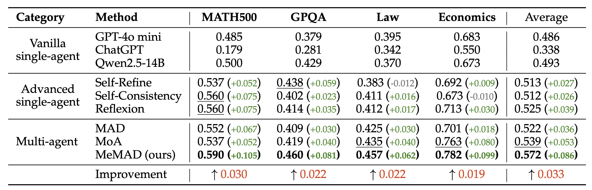

<div align="center">
<h2 align="center">
  <b>MeMAD: Structured Memory of Debates for Enhanced Multi-Agent Reasoning</b>
</h2>
<div>
<a target="_blank" href="https://scholar.google.com/citations?user=DoXxoQIAAAAJ">Shuai&#160;Ling</a><sup>1,3</sup>,
<a target="_blank" href="https://scholar.google.com.sg/citations?user=W2b08EUAAAAJ&hl=en">Lizi&#160;Liao</a><sup>2</sup>,
<a target="_blank" href="https://scholar.google.com/citations?user=Awsue7sAAAAJ">Dongmei&#160;Jiang</a><sup>3&#9993;</sup>,
<a target="_blank" href="https://dblp.org/pid/236/2820.html">Weili&#160;Guan</a><sup>1&#9993;</sup>
</div>
<sup>1</sup>Harbin Institute of Technology (Shenzhen)&#160;&#160;
<sup>2</sup>Singapore Management University&#160;&#160;
<sup>3</sup>Pengcheng Laboratory
<br/>
<sup>&#9993;&#160;</sup>Corresponding authors
<br/>
<div align="center">
    <a href="https://openreview.net/forum?id=zLbmsdyTiN" target="_blank">
    </a>
    <a href="https://github.com/iLearn-Lab/COLM25-MeMAD" target="_blank">
    </a>
</div>
</div>

---

## Updates

- [04/2025] Paper accepted at COLM 2025.
- [04/2025] Code released.

---

## Introduction

We propose **MeMAD**, a parameter-free memory-augmented Multi-Agent Debate (MAD) framework. Existing MAD systems treat each debate independently, discarding the rich reasoning trajectories and feedback accumulated in past interactions. MeMAD addresses this by storing structured debate experiences — enriched with self-reflection and peer-reflection — in a vector memory bank (ChromaDB). At inference time, semantically similar experiences are retrieved and injected into agent prompts to guide new debates, without any parameter updates.

---

## Framework



**Figure 1.** MeMAD consists of two phases: (1) **Experience Accumulation** — a dual-level feedback mechanism (Self-Reflection Module + Peer-Reflection Module) generates structured experiences from training debates and stores them in a Memory Bank; (2) **Retrieval and Inference** — at test time, relevant positive and negative experiences are retrieved via semantic similarity and injected into agent prompts.

---

## Project Structure

```text
COLM25-MeMAD/
├── config/
│   ├── autogen_openai_models.json     # Model capability flags (OpenAI)
│   ├── autogen_ollama_models.json     # Model capability flags (Ollama)
│   ├── autogen_ds_models.json         # Model capability flags (DeepSeek)
│   └── litellm_ollama_config.yaml     # LiteLLM proxy config for local models
├── Models/MemoryMAD/
│   ├── memory_mad.py                  # Main entry — run MeMAD debate (Phase 2)
│   ├── prepare_memory.py              # Build memory bank from training debates (Phase 1)
│   ├── run_mmad.sh                    # Example Phase 2 commands
│   └── run_prepare_memory.sh          # Example Phase 1 commands
└── utils/
    ├── config.py                      # Path & LLM configuration (fill before running)
    ├── agent_memory.py                # ChromaDB vector store wrapper
    ├── utils_agents.py                # Agent, DebateManager, Question
    ├── utils_memory.py                # Memory retrieval utilities
    ├── prompts.py                     # Prompt templates
    ├── parser.py                      # Answer extraction & parsing
    └── utils.py                       # DataLoader, ModelClient, Logger
```

---

## Installation

```bash
git clone https://github.com/iLearn-Lab/COLM25-MeMAD.git
cd COLM25-MeMAD
pip install autogen-ext autogen-core chromadb litellm openai
```

For local models via [Ollama](https://ollama.com), start the LiteLLM proxy:

```bash
litellm --config config/litellm_ollama_config.yaml
```

---

## Configuration

Edit `utils/config.py` to set your paths:

```python
CONFIG = {
    "PROJECT_PATH":    Path("/path/to/COLM25-MeMAD"),
    "PERSISTENT_DIR":  Path("/path/to/chromadb_store"),
    "DATA_DIR":        Path("/path/to/datasets"),
    "MEMORY_DATA_DIR": Path("/path/to/memory_data"),
    "CONFIG_DIR":      Path("/path/to/COLM25-MeMAD/config"),
    "API_RATE_LIMIT":  60,
}
```

Set API keys as environment variables:

```bash
export OPENAI_API_KEY="sk-..."
export DEEPSEEK_API_KEY="sk-..."   # optional
```

---

## Dataset

| Dataset | Domain | Train | Test |
|---|---|---:|---:|
| [MATH500](https://huggingface.co/datasets/HuggingFaceH4/MATH-500) | Mathematics | ~100/category (level ≥ 3) | 134 (level 5) |
| [GPQA](https://huggingface.co/datasets/Idavidrein/gpqa) | Biology / Physics / Chemistry | GPQA Main \ Diamond | 198 |
| [MMLUPro-Law](https://huggingface.co/datasets/TIGER-Lab/MMLU-Pro) | Law | 826 | 276 |
| [MMLUPro-Economics](https://huggingface.co/datasets/TIGER-Lab/MMLU-Pro) | Economics | 633 | 211 |

Place datasets under `CONFIG["DATA_DIR"]`. See `DataLoader` in `utils/utils.py` for the expected JSON format.

---

## Usage

**Phase 1 — Build Memory Bank** (run once on training data)

```bash
cd Models/MemoryMAD
python prepare_memory.py --question_type MATH500        --memory_content_type QSRE
python prepare_memory.py --question_type GPQA           --memory_content_type QSRE
python prepare_memory.py --question_type MMLUPro_Law    --memory_content_type QSRE
python prepare_memory.py --question_type MMLUPro_Economics --memory_content_type QSRE
```

**Phase 2 — Run MeMAD Inference**

```bash
python memory_mad.py --question_type MATH500        --if_use_memory --memory_type PN --n_retrival 1 --memory_content_type QSRE --verbose --log_name "MATH500"
python memory_mad.py --question_type GPQA           --if_use_memory --memory_type PN --n_retrival 1 --memory_content_type QSRE --verbose --log_name "GPQA"
python memory_mad.py --question_type MMLUPro_Law    --if_use_memory --memory_type PN --n_retrival 1 --memory_content_type QSRE --verbose --log_name "MMLUPro_Law"
python memory_mad.py --question_type MMLUPro_Economics --if_use_memory --memory_type PN --n_retrival 1 --memory_content_type QSRE --verbose --log_name "MMLUPro_Economics"
```

To run without memory (MAD baseline), simply omit `--if_use_memory`.

Key arguments: `--models` (semicolon-separated model keys, default `gpt4omini;gpt4omini;gpt4omini`), `--embedding_model` (`bgem3` / `nomic` / `mxbai`), `--max_rounds` (default `3`).

---

## Results



MeMAD outperforms all baselines.

---

## Citation

If you find this work useful, please cite:

```bibtex
@inproceedings{
ling2025memad,
title={Me{MAD}: Structured Memory of Debates for Enhanced Multi-Agent Reasoning},
author={Shuai Ling and Lizi Liao and Dongmei Jiang and Weili Guan},
booktitle={Second Conference on Language Modeling},
year={2025},
url={https://openreview.net/forum?id=zLbmsdyTiN}
}
```

---

## Acknowledgement

This research is supported by the National Research Foundation, Singapore (AISG Award No: AISG-NMLP-2024-002), the National Natural Science Foundation of China (U24A20328, 62476071), and the Guangdong Basic and Applied Basic Research Foundation (2025A1515011732).

---

## License

This project is released under the [Apache License 2.0](https://www.apache.org/licenses/LICENSE-2.0).
